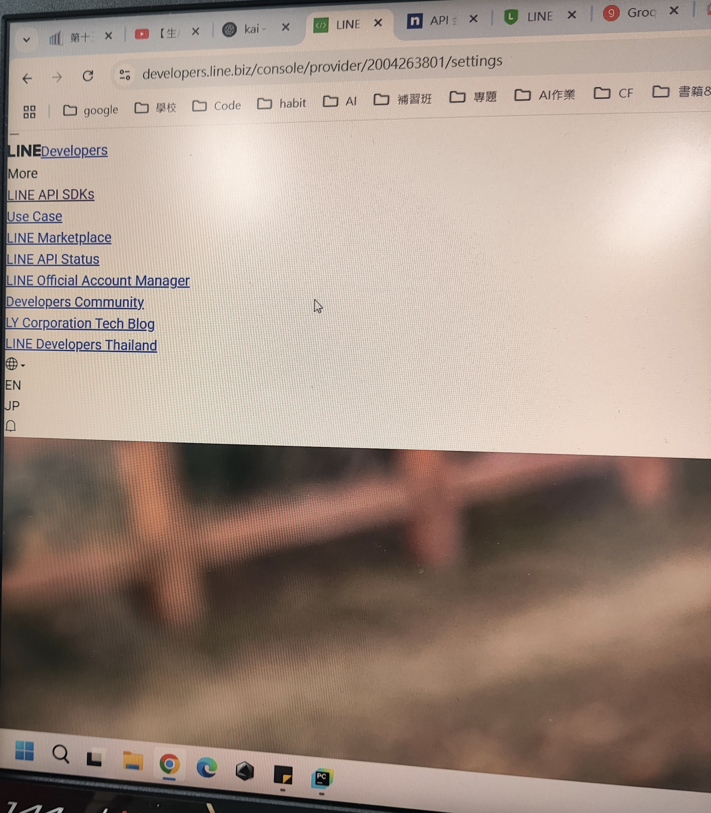

# 補充：Line Developer CSS 格式跑版

**若在開啟 LINE Developers 頁面時，畫面顯示異常、排版錯亂，是 CSS 沒有正確載入所致。**
* 解決方式
  * 暫時關閉所有擋廣告插件
  * 按下`Ctrl + Shift + R`重整，會恢復原本介面。
使用 F5 只會重新載入部分資源，不會更新快取的 CSS 或 JS，因此無法解決排版錯亂的問題。

>圖1-22.畫面排版錯亂
>

>  
>

---
[上一頁](STEP_6.md)| [目錄](README.md) |下一頁
