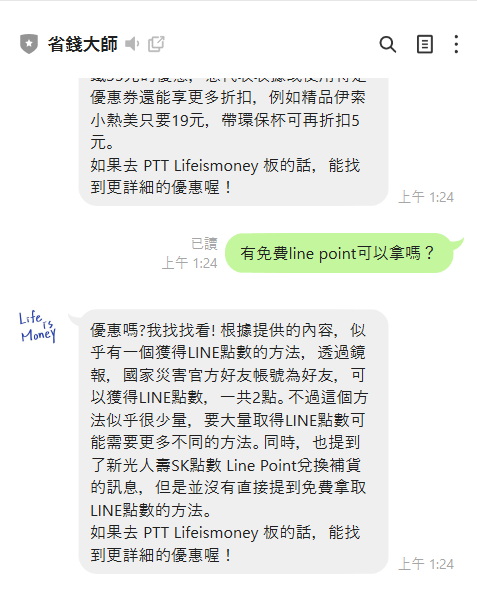
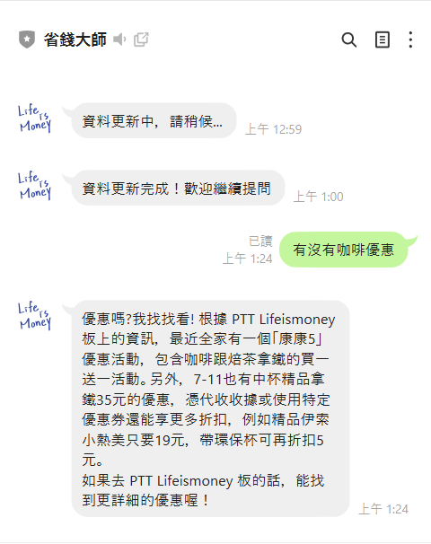

# Line 機器人應用： RAG 系統

### 前言：
我經常瀏覽 PTT 的 Marvel 版和 Lifeismoney 版，其中主要關注 Lifeismoney 版，幾乎每天會開啟 2 到 3 次。在實作 RAG 系統時，我注意到可以利用 Lifeismoney 版的文章內容作為資料庫使用，以此為主題製作期末專案：將 RAG 系統整合至 Line 機器人中應用。

### 目錄：
*  一、[建立 Line 機器人](STEP_1.md)
*  二、[建立 Groq API 聊天系統](STEP_2.md)
*  三、[整合 Line 機器人與 Groq API](STEP_3.md)
*  四、[建立 RAG 系統](STEP_4.md)
*  五、[整合 RAG 系統與 Line 機器人](STEP_5.md)
*  六、[一鍵啟動 Line 機器人](STEP_6.md)

### 大綱：
* 本專案使用 PyCharm 作為主要的程式編輯與執行環境。
* 所有程式碼皆使用 Python 撰寫，主程式為[ appV2.py ](Code/appV2.py)，搭配`Flask`建立本地伺服器。
* 使用[ PTTcrawler.py ](Code/PTTcrawler.py)從 PTT Lifeismoney 版爬取最新 100 篇文章，儲存為文字檔。
* 使用[ FAISS.py ](Code/FAISS.py)將爬取的文章切割並轉換為向量儲存，建立本地知識庫。
* 使用[ rag_chain.py ](Code/rag_chain.py)實作 RAG 系統，整合 FAISS 與 Groq API 回答用戶問題。
* 使用 Ngrok 建立對外公開網址，提供 Line Webhook 使用。
* 使用[ dev_server.py ](Code/dev_server.py)自動啟動 Flask 與 Ngrok，完成 Webhook 設定。

### 功能：

* 當使用者詢問生活優惠相關問題，系統會自動檢索資料庫並生成回應。
* 指令：
  * **幫助/說明**：列出使用教學與功能介紹。
  * **更新資料**：抓取最新 PTT 文章並更新資料庫。
  * **一般提問**：查詢生活優惠資訊並回覆。
* LINE 聊天室為主要的操作與互動介面。

### 使用工具：

| 類別| 工具 / 技術|
| ------|------------------------------------------------|
| 爬蟲|`requests`,`BeautifulSoup`|
| 向量資料庫|`FAISS`|
| 向量模型|`intfloat/multilingual-e5-small`|
| 語言模型|`Groq API`(llama-3.3-70b-versatile)|
| Line 機器人|`Line Messaging API`, `line-bot-sdk`|
| 伺服器|`Flask`,`Ngrok`|
| 自動啟動腳本|`dev_server.py`(整合啟動 Flask + Ngrok + Webhook 設定)|

### 成果與展示：

* 輸入關鍵字，傳送想詢問的優惠，會即時提供優惠推薦：
>

>  
>  
>

---

上一頁| [目錄](README.md) |[下一頁](STEP_1.md)
