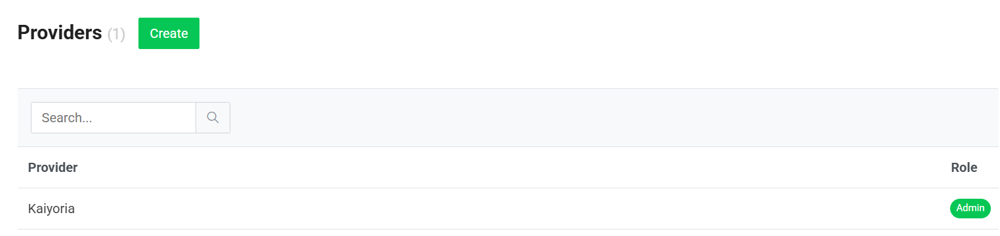
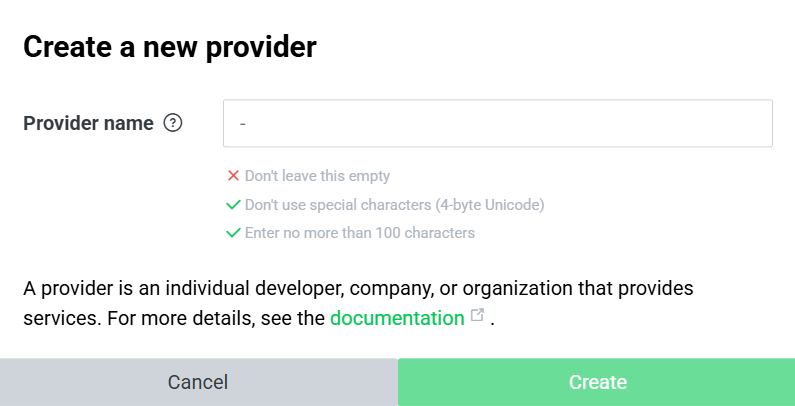
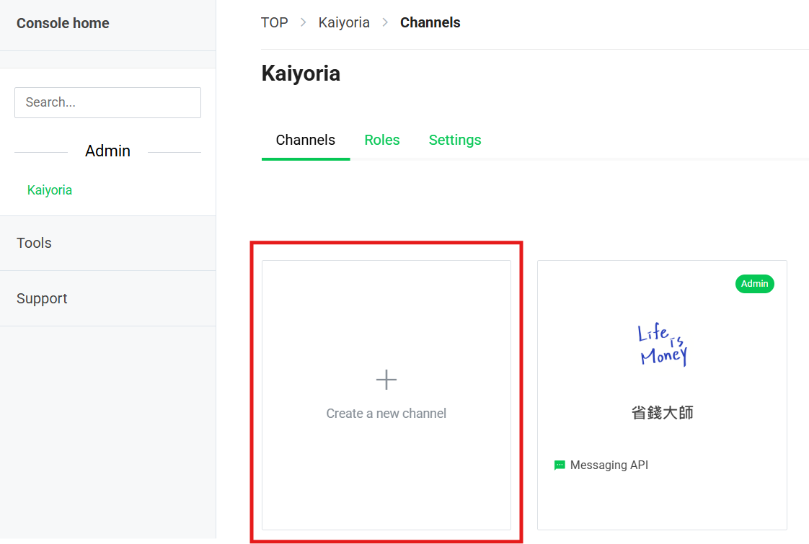
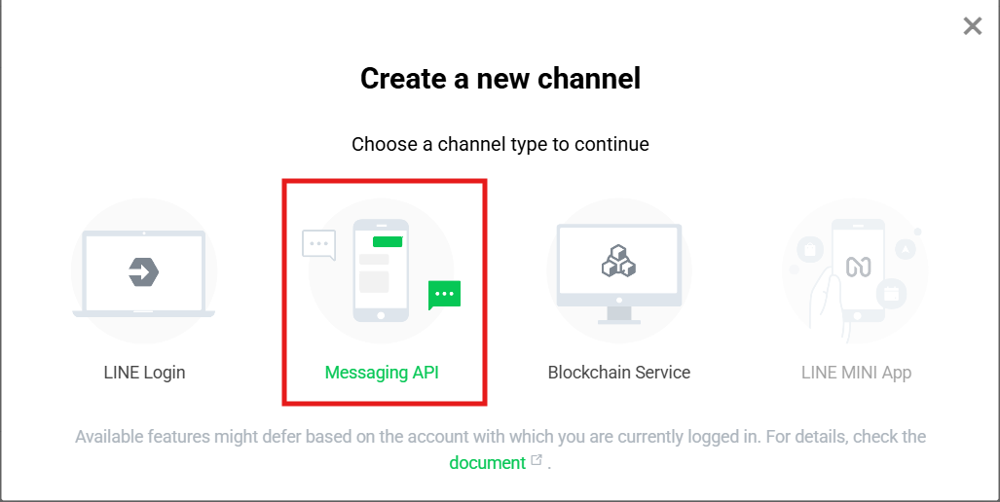
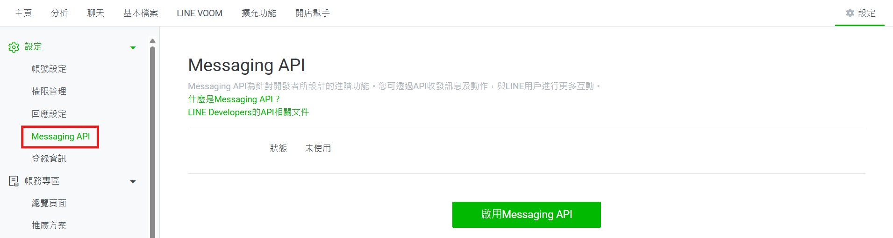

# 一、建立Line機器人

### 1. 申請 LINE Developers 帳號
* 前往 Line Developer [(點擊可直接進入)](https://developers.line.biz/zh-hant/)
* 使用 LINE 帳號登入/註冊
* 建立一個 Provider (命名完可更改名稱)

>圖1-1.建立帳號
>
>

>圖1-2.帳號命名
>
>

### 2. 建立 Messaging API 頻道
* 點擊建立頻道
* 選擇頻道種類： Messaging API
* 頻道建立完成會轉到 Line Official Account
* 點擊設定->啟用 Messaging API ->選擇先前建立的 Provider ->啟用 Message API

>圖1-3.建立頻道
>
>

>圖1-4.選擇頻道種類
>
>

>圖1-5.申請頻道 Messaging API
>
>

### 3.取得LINE API 鑰匙
* 在 Line Developer 中，點選 Channel 的 Basic settings 取得 Channel secret。
* 在 Line Developer 中，點選 Channel 的 Messaging API settings 取得 Channel access token。
> Channel secret 用途：確認使用者傳送訊息的真實性，防止偽造、篡改訊息或發送惡意指令。
> 
> Channel access token 用途：授權機器人向 LINE 平台發送訊息、管理好友等操作

### 補充
* Line Developer CSS 格式跑版

[上一頁](README.md)| 第二頁 |[下一頁](STEP_2.md)
