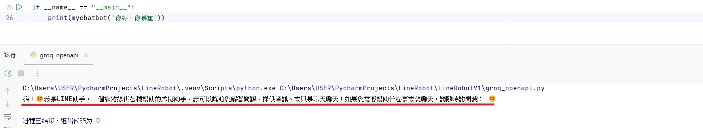

# 二、建立 Groq API 對話系統
本專案使用 PyCharm 作為主要的程式編輯與執行環境

### 1.註冊 Groq API
* 搜尋 Groq PlayGround ->點選 API KEYS -> Create API Key ->**複製 API Key**

### 2.建立存放 API 金鑰的文件
* 建立`.env`檔，將先前獲得的 Channel secret、Channel access token、Groq API key 貼上`.env`檔內，如以下格式：

```
LINE_CHANNEL_ACCESS_TOKEN=(輸入您的LINE_CHANNEL_ACCESS_TOKEN)
LINE_CHANNEL_SECRET=(輸入您的LINE_CHANNEL_SECRET)
GROQ_API_KEY=(輸入您的GROQ_API_KEY)
```

### 3.實作對話系統
- [實作檔案](Code/groq_openapi.py)
- 安裝套件：
```
pip install openai           #操作 Groq OpenAI API 的官方 Python 客戶端
pip install python-dotenv    #載入 .env 檔案中的 API 金鑰
```
- 功能介紹：實作與 Groq 提供的 OpenAI API（llama-3.3-70b-versatile模型）互動的聊天函式。

    - 使用`dotenv`套件從`.env`檔案中載入環境變數`GROQ_API_KEY`，提高可維護性。
    - 建立用`client`物件呼叫 Groq OpenAI API 功能，並使用環境變數的金鑰做身份驗證。
    - 在訊息中，使用`content`指定 AI 用中文回覆，由`role: "system"`指定扮演「有幫助的 LINE 助手」。
    - 建立`mychatbot`函式，根據使用者`prompt`，把回應加回對話紀錄並回傳回應給使用者


* 如果想確認是否可以對話，可輸入以下程式並執行：
```
if __name__ == "__main__":
    print(mychatbot('你好 ，你是誰？'))
```

>圖1-9.輸出結果
>
>

[上一頁](STEP_1.md)| [目錄](README.md) |[下一頁]
