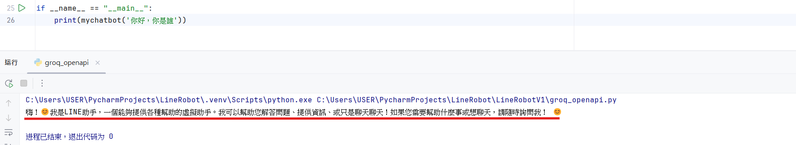

# 二、建立 Groq API 對話系統
本專案使用 PyCharm 作為主要的程式編輯與執行環境

### 1.註冊Groq API
* 搜尋 Groq PlayGround ->點選 API KEYS -> Create API Key ->**複製 API Key**

### 2.建立存放金鑰匙的文件
* 建立`.env`檔，將先前獲得的 Channel secret、Channel access token、Groq API key貼上`.env`檔內，如以下格式：

```
LINE_CHANNEL_ACCESS_TOKEN=(輸入您的LINE_CHANNEL_ACCESS_TOKEN)
LINE_CHANNEL_SECRET=(輸入您的LINE_CHANNEL_SECRET)
GROQ_API_KEY=(輸入您的GROQ_API_KEY)
```

### 3.實作對話系統
* [檔案](Code/groq_openapi.py)
* 功能：實作與 Groq 提供的 OpenAI API（llama-3.3-70b-versatile模型）互動的聊天函式。

* 如果想確認是否可以對話，可輸入以下程式並執行：
```
if __name__ == "__main__":
    print(mychatbot('你好 ，你是誰？'))
```

>圖1-7.輸出結果
>
>

[上一頁](STEP_1.md)| 第三頁 |[下一頁]
