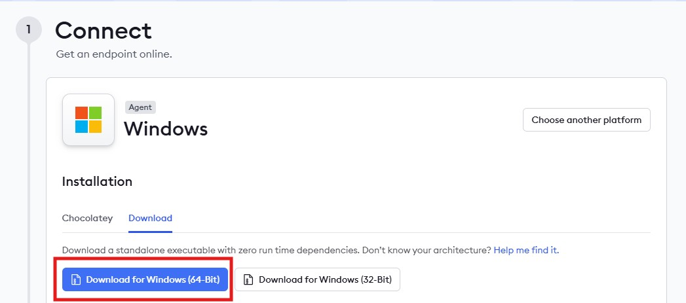
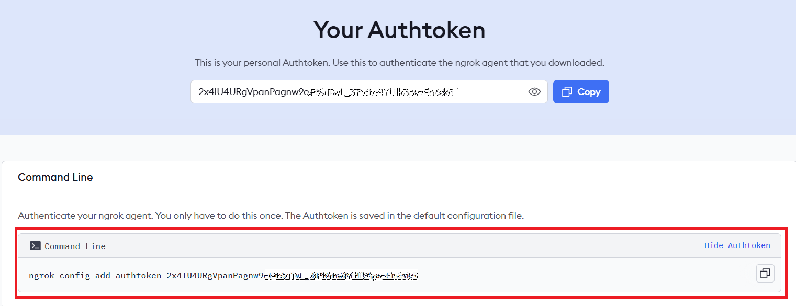
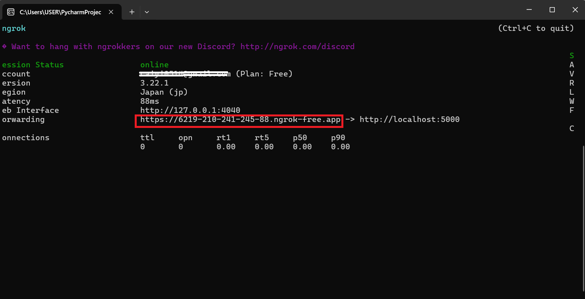

# 三、整合 Line 機器人與 Groq API

Line 機器人必須透過 webhook 接收用戶端發送的消息，由於我在本地端使用 PyCharm 撰寫並執行程式，需建立對外開放的服務，以下是我的方法：使用 Flask 架設 HTTP 伺服器，並透過 ngrok 將本地的埠號導向一個可供外部連線的公開網址。

### 1.下載 ngrok
ngrok 是用來建立一個公開網址，讓 Line 平台可以連線到我本地端的程式；而ngrok 提供雲端伺服器支援，每次啟動時會產生一組臨時的公開網址，也可以透過付費方案綁定固定網域。

* [造訪 ngrok 官方網站（需註冊）](https://ngrok.com/)
* 選擇下載 Download for Windows (64-Bit)。解壓縮後獲得`ngrok.exe`。
>圖1-10.下載 Download for Windows (64-Bit)
>
>
* 回到網站，點擊 Your Authtoken，複製 Command Line 下的 Authtoken。
>圖1-11.命令提示字元使用的 Authtoken
>
>

* 開啟命令提示字元，切換到 `ngrok.exe` 所在資料夾，輸入 Authtoken。
* 完成輸入後，會看到以下訊息：
  ```
  Authtoken saved to configuration file: C:\Users\你的使用者名稱\.ngrok2\ngrok.yml
  ```
### 2.使用 Flask 串接 Line 機器人以及 Groq API

Flask 是我在本地建立的一個伺服器，用來接收 Line 傳來的 webhook 訊息，並根據用戶輸入做出回應。

* [實作檔案](Code/app.py)
* 請先安裝以下套件：
```
pip install flask            #建立能接收訊息並回應的伺服器
pip install line-bot-sdk     #Line Messaging API 的官方 Python SDK
pip install python-dotenv    #載入 .env 檔案中的 API 金鑰
```
* 功能介紹：整合 Groq OpenAI 聊天函式製作 LINE 聊天機器人後端服務。
  * 使用`dotenv`套件讀取`.env`檔案中的 API 金鑰
  * 使用`line-bot-sdk`中的`WebhookHandler`驗證來自 Line 的認證以確保訊息安全。
  * 使用`Flask`建立本地端伺服器，接收 Line webhook 發送到`/callback`路徑的請求。
  * 註冊訊息事件處理函式，當收到用戶文字訊息時：
    * 取得用戶傳來的文字內容
    * 呼叫自訂的 `mychatbot` 函式（來源於 `groq_openapi` ），取得聊天回覆
    * 利用 `line_bot_api.reply_message()` 回覆文字訊息給用戶
  * 執行程式時，啟動 Flask 伺服器監聽本機 5000 埠口。

### 3.執行與測試
* 開啟`ngrok.exe`，輸入以下指令加上 Flask 使用的埠口。例如，使用本機 5000 埠口：
```
ngrok http 5000
```
* 輸入完會出現以下畫面：
>圖1-12.`ngrok.exe`的執行畫面
>
>
* 複製Forwarding後的網址(紅線圈選處)

[上一頁](STEP_2.md)| [目錄](README.md) |[下一頁](STEP_4.md)
