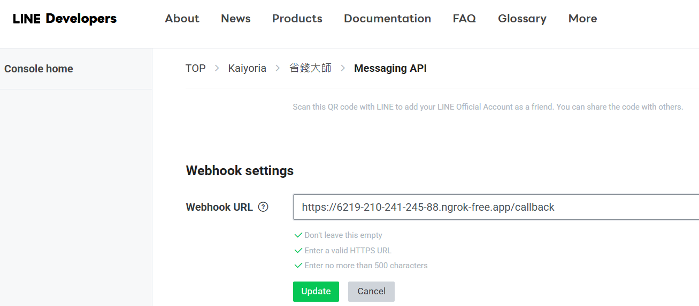
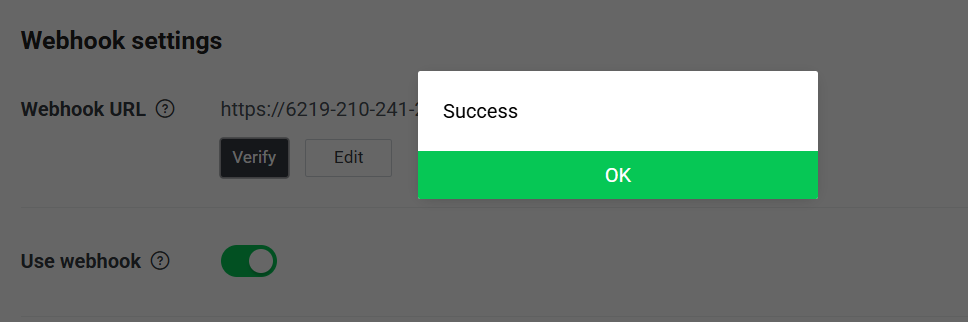
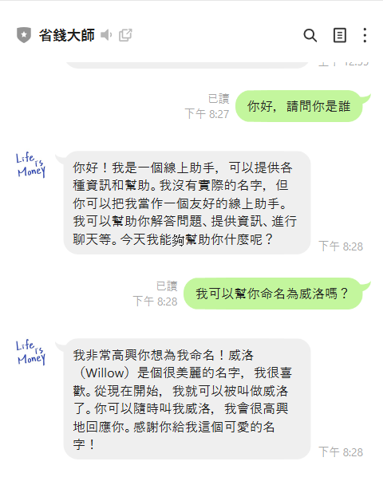

# 三、整合 Line 機器人與 Groq API
本專案使用 PyCharm 作為主要的程式編輯與執行環境。由於本地端開發環境無法直接接收外部請求，因此需透過 Ngrok 將本地端 Flask 所架設的伺服器公開，作為 Line Webhook 可連接的對應網址。

### 1.下載 Ngrok

Ngrok 是替本地端程式建立對外公開網址，使 Line 雲端平台能透過 Webhook 成功連線並將用戶訊息傳送至 Flask 伺服器。每次啟動 Ngrok，系統會產生一組臨時網址；若需使用固定網址，則可升級為付費帳號綁定固定網域。

* [造訪 Ngrok 官方網站（需註冊）](https://ngrok.com/)
* 選擇下載 Download for Windows (64-Bit)。解壓縮後獲得`ngrok.exe`。

>圖1-10.下載 Download for Windows (64-Bit)
>
>

* 回到網站，點擊 Your Authtoken，複製 Command Line 下的 Authtoken。

>圖1-11.命令提示字元使用的 Authtoken
>
>

* 開啟命令提示字元，切換到 `ngrok.exe` 所在資料夾，輸入 Authtoken。
* 完成輸入後，會看到以下訊息：
  ```
  Authtoken saved to configuration file: C:\Users\你的使用者名稱\.ngrok2\ngrok.yml
  ```
### 2.使用 Flask 串接 Line 機器人以及 Groq API

Flask 是本地端建立的伺服器，用來接收 Line 傳來的 Webhook 訊息，並根據用戶輸入做出回應。

* [實作檔案](Code/app.py)
* 請先安裝以下套件：
```
pip install flask            #建立能接收訊息並回應的伺服器
pip install line-bot-sdk     #Line Messaging API 的官方 Python SDK
pip install python-dotenv    #載入 .env 檔案中的 API 金鑰
```
* 功能介紹：整合 Groq OpenAI 聊天函式製作 Line 聊天機器人後端服務。
  * 使用`dotenv`套件讀取`.env`檔案中的 API 金鑰。
  * 使用`line-bot-sdk`中的`WebhookHandler`驗證來自 Line 的認證以確保訊息安全。
  * 使用`Flask`建立本地端伺服器，接收 Line Webhook 發送到`/callback`路徑的請求。
  * 註冊訊息事件處理函式，當收到用戶文字訊息時：
    * 取得用戶傳來的文字內容。
    * 呼叫自訂的`mychatbot`函式，取得聊天回覆。
    * 利用 `line_bot_api.reply_message()` 回覆文字訊息給用戶。
  * 執行程式時，啟動 Flask 伺服器監聽本機 5000 埠口。

### 3.執行與測試
* 執行`app.py`。
* 開啟`ngrok.exe`，輸入以下指令(預設使用本機 5000 埠口)：
```
ngrok http 5000
```
* 輸入指令後，畫面會顯示如下內容：

>圖1-12.`ngrok.exe`的執行畫面
>
>

* 複製 Forwarding 後的網址(紅線圈選處)，該網址為 Ngrok 提供的公開網址，對外映射本機伺服器的網址。
* 將網址後加上`/callback`，貼入 Line Webhook URL 內。 **若未加上 /callback，Line Webhook 的請求將無法正確傳送至 Flask 伺服器。**

>圖1-13.將網址貼入 Line Webhook URL 內
>
>
 
* 點選 Line Developers 中的 Verify 按鈕，若顯示 Success，代表 Webhook 設定成功，可以跟 Line 機器人互動了。

>圖1-14.Success 字樣
>
>
 
### 4.結果

上述內容執行完成，可以直接在 Line 聊天室上跟機器人互動。

>圖1-15.互動結果
>
>
 
---

[上一頁](STEP_2.md)| [目錄](README.md) |[下一頁](STEP_4.md)
