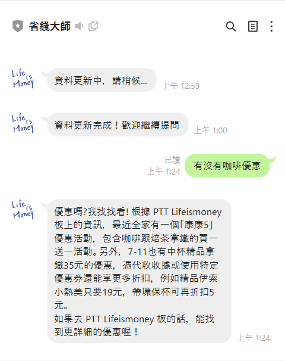

# 整合 RAG 系統與 Line 機器人
透過 Line 介面與 RAG 系統互動，將爬蟲、向量資料庫與語言模型生成功能串接至 Line 機器人，製作可即時對話的生活優惠查詢助手。

### 1.系統架構與功能設計
* [實作檔案](Code/appV2.py)
* 使用`Flask`建立本地伺服器，接收 Line Webhook 訊息並進行處理。
* 用戶訊息事件依照輸入內容分流執行：
  * `幫助 / 說明` → 顯示使用方式與功能列表。
  * `更新 / 資料` → 呼叫`PTTcrawler.py`及`FAISS.py`更新 PTT 資料與向量庫。
  * 其他訊息 → 呼叫`chat_with_rag()`啟動 RAG 模型進行語意檢索與問答生成。
* 程式執行後開啟本地端 5000 埠口，透過 Ngrok 建立外部可連接網址供 Line 使用。

### 2.結果

* 使用說明：
  * 傳送幫助/說明，會出現使用方法說明：
  * 首次加入好友時也會出現。

>圖1-17、1-18.輸入幫助/說明
>

>  
>  
>

* 傳送更新資料，會出現更新文字說明：
   * 收到更新資料後，先傳送「資料更新中，請稍候...」
   * 更新完資料後，才會傳送「資料更新完成！歡迎繼續提問」

>圖1-19.輸入更新資料
>

>  
>

* 直接輸入欲查詢的優惠資訊，例如「咖啡有優惠嗎」，系統會回應相關文章摘要內容：

>圖1-20.詢問問題
>

>  
>  
>

---
[上一頁](STEP_4.md)| [目錄](README.md) |[下一頁](STEP_6.md)
