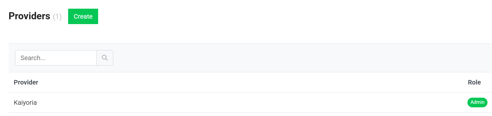
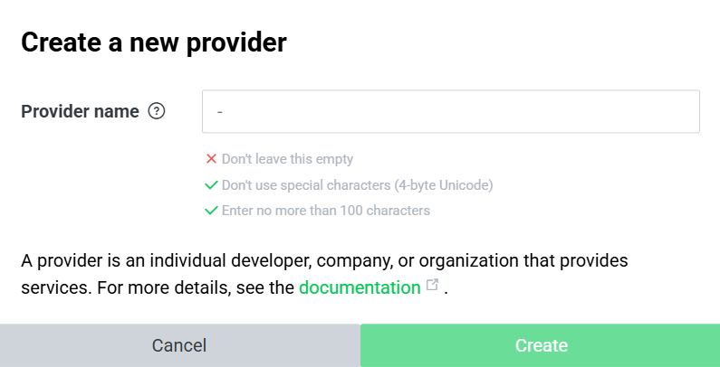
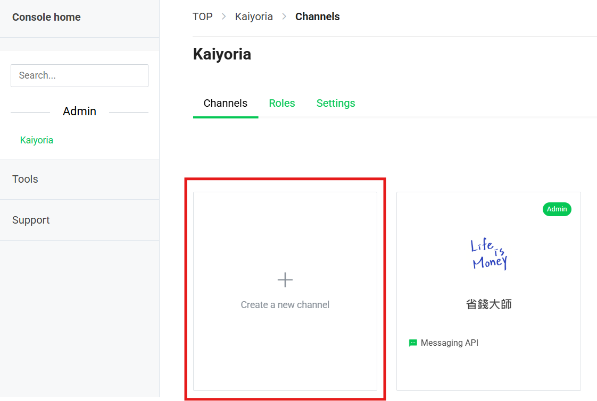
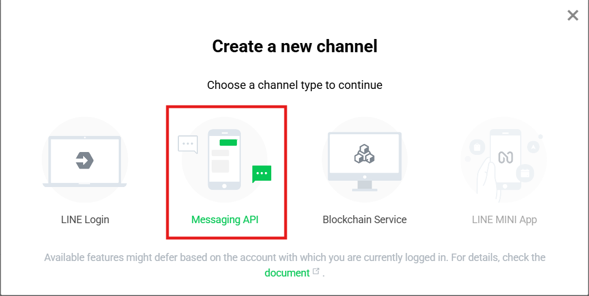

# 註冊Line機器人

### 1. 申請 LINE Developers 帳號
* 前往 Line Developer [(點擊可直接進入)](https://developers.line.biz/zh-hant/)
* 使用 LINE 帳號登入/註冊
* 建立一個 Provider (命名完可更改名稱)

>圖1-1.建立帳號
>
>

>圖1-2.帳號命名
>
>

### 2. 建立 Messaging API 頻道
* 點選建立頻道

>圖1-3.建立頻道
>
>

* 選擇頻道種類：Messaging API

>圖1-3.選擇頻道種類
>
>

